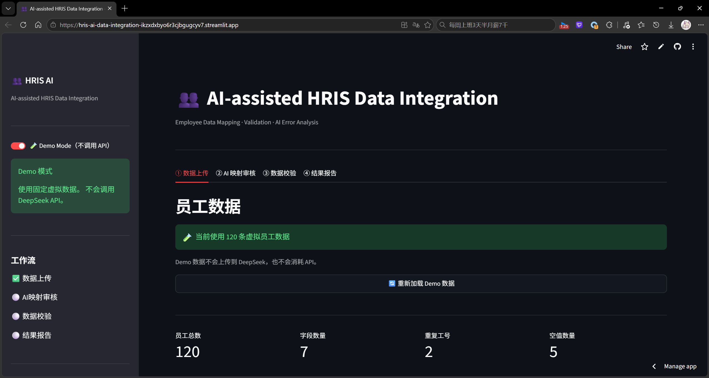
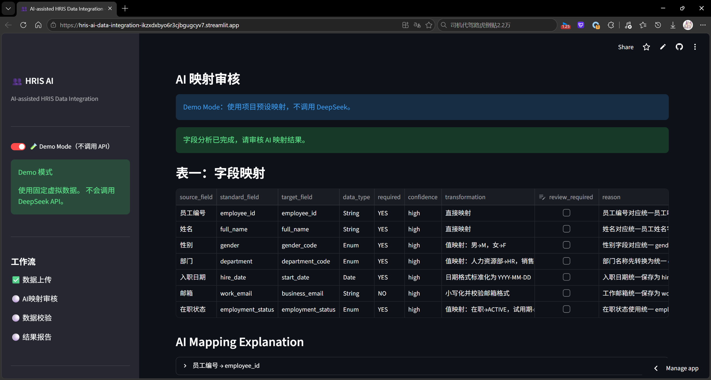
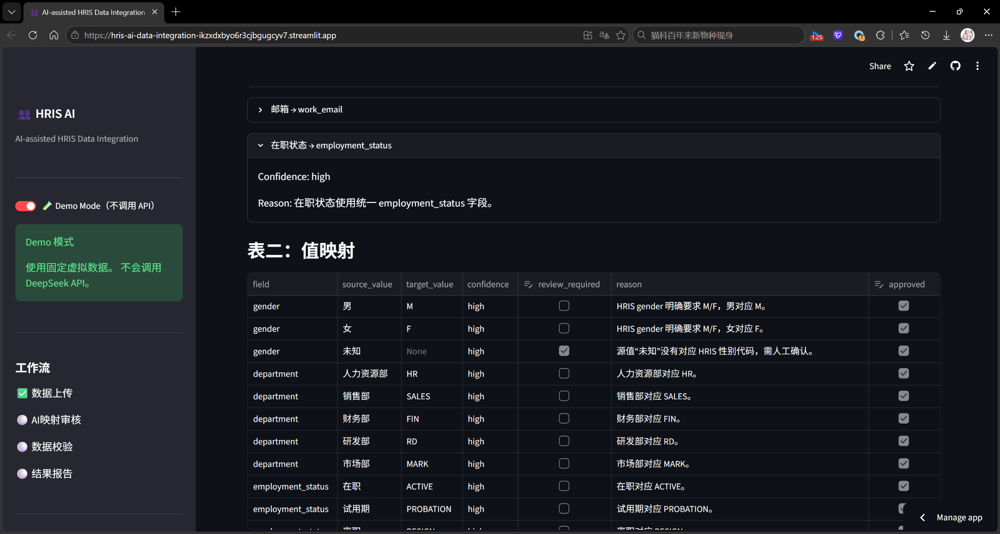
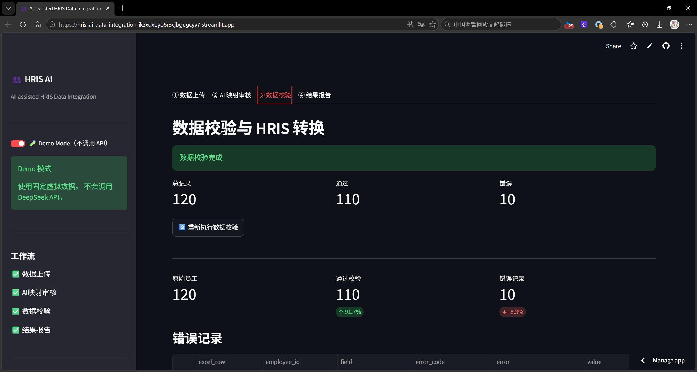
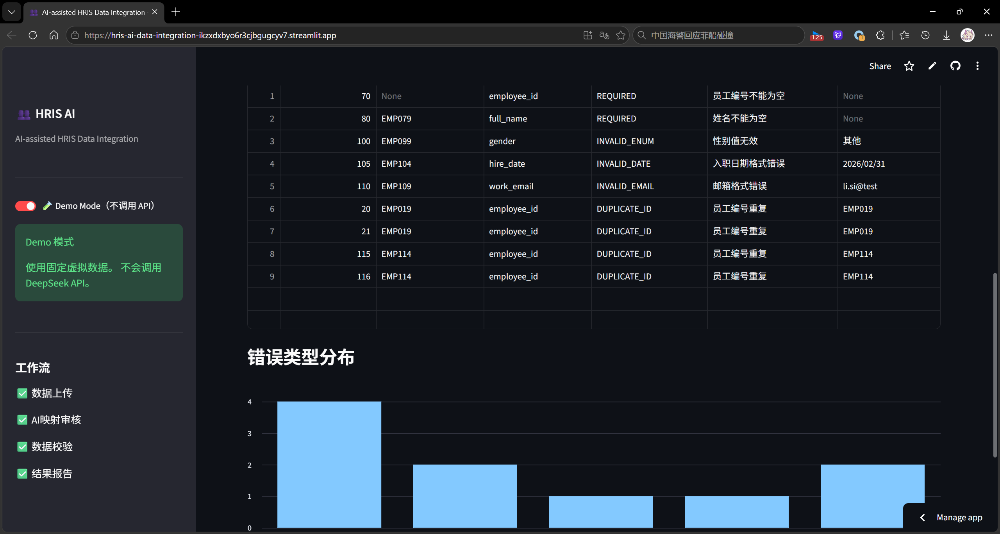
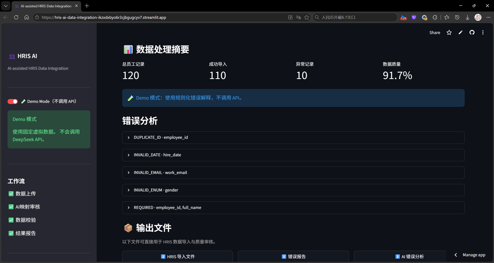
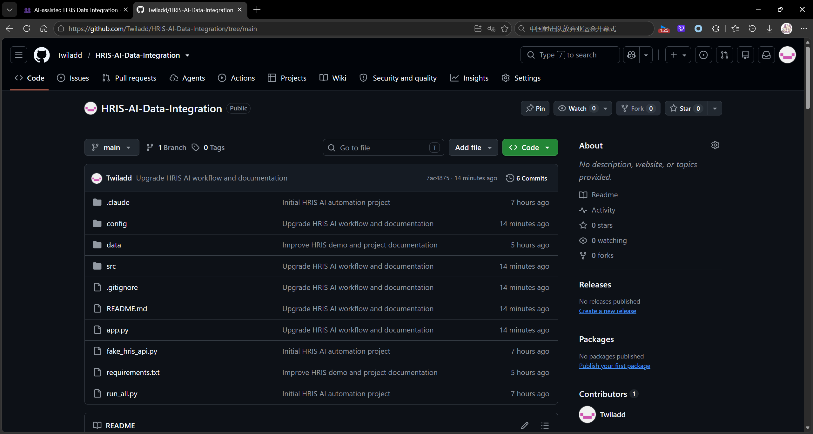

# AI-assisted HRIS Data Integration Workflow

## Live Demo

[Try the Live Demo](https://hris-ai-data-integration-ikzxdxbyo6r3cjbgugcyv7.streamlit.app/)

> Demo Mode is enabled by default and does not consume DeepSeek API credits.

## Overview

An AI-assisted HRIS data integration workflow that automates employee data mapping, validation, error analysis, and HRIS-ready export generation.

The system transforms raw employee Excel files into standardized HRIS import packages through AI-assisted mapping and automated data quality validation.

## Demo Screenshots

### Workflow Overview

### AI Mapping Review

### Data Validation

### Result Report

### GitHub Repository

## Key Features

### 1. AI-assisted Field Mapping

- Automatically analyzes employee data fields
- Suggests HRIS standard field mappings
- Provides confidence levels
- Generates mapping explanations
- Supports human review and approval

### 2. Human-in-the-loop Review

The system allows HR users to:

- Review AI mapping suggestions
- Check confidence levels
- Approve or modify mappings before processing

### 3. Data Validation

Automatically detects:

- Missing required fields
- Invalid data formats
- Unsupported HRIS values
- Data quality issues

### 4. AI Error Analysis

Using DeepSeek API, the system provides:

- Error explanations
- Possible causes
- Recommended actions

### 5. HRIS Export Generation

Generates:

- HRIS import file
- Data validation error report
- AI analysis report

## Workflow

Employee Excel Data

    ↓

AI Field Mapping
(DeepSeek API)

    ↓

Human Review & Approval

    ↓

Data Validation Engine

    ↓

AI Error Analysis

    ↓

HRIS Import Package

## Technology Stack

- Python
- Pandas
- Streamlit
- DeepSeek API
- Excel Processing
- Git/GitHub

## System Architecture

          Employee Excel

                |

                ↓

      Data Processing Layer

                |

                ↓

      AI Mapping Engine

         (DeepSeek API)

                |

                ↓

      Human Review Layer

                |

                ↓

      Validation Engine

                |

                ↓

      HRIS Export Files

## Demo Mode

The project provides a Demo Mode that allows users to experience the complete workflow without consuming API credits.

## Real Mode

Real Mode supports:

- Custom employee data upload
- AI-powered field mapping
- DeepSeek-powered analysis

## Project Structure

HRIS-Automation

├── app.py                      # Streamlit web application
├── src/
│   ├── web_pipeline.py         # mapping, transformation, validation, AI analysis
│   ├── ai_mapper.py            # AI field/value mapping
│   └── ai_error_analyzer.py    # AI error analysis
├── config/
│   ├── mapping_config.xlsx     # field/value mapping + validation rules
│   └── hris_schema.xlsx        # HRIS target schema
├── data/
│   └── demo_employees.xlsx     # demo employee data
├── requirements.txt
└── README.md

## Future Improvements

- HRIS API integration
- Database connection
- Role-based access control
- Advanced AI recommendation system
